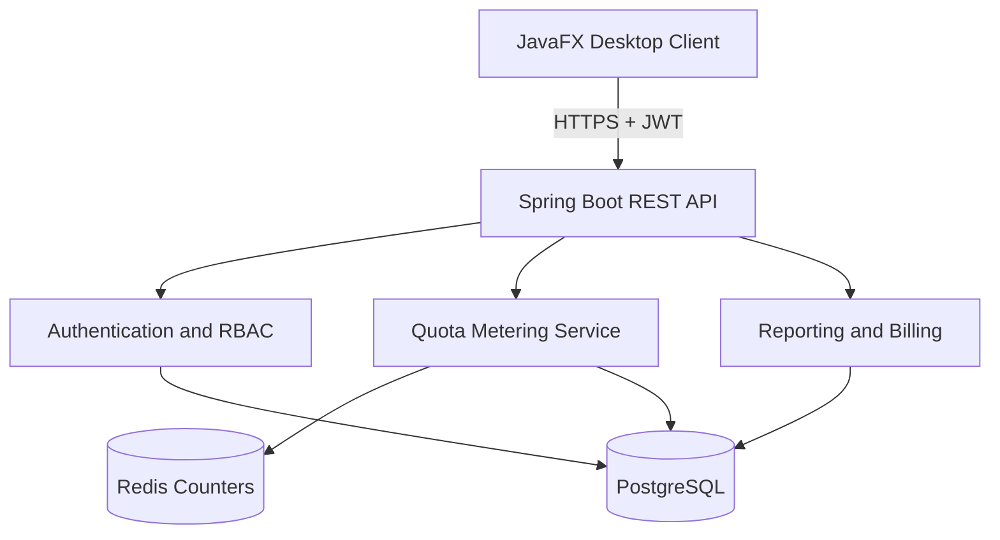

# Quota Flow

Quota Flow is a multi-tenant resource quota and cost-allocation platform built for SaaS and cloud-infrastructure teams. It tracks each tenant's API requests, storage, compute time, and background jobs; enforces configurable limits; raises live alerts; and produces billing-ready usage summaries.

## Live deployment

- Web application: https://quota-flow-ui.onrender.com/
- Backend API: https://quota-flow.onrender.com
- Health check: https://quota-flow.onrender.com/api/health
- Source code: https://github.com/Tejashribambal19/quota-flow

> The Render free instance can take about 50 seconds to wake after inactivity. The user interface is a JavaFX desktop application, so the backend URL displays API responses rather than a website.

## Key features

- Multi-tenant isolation with platform-admin and tenant-admin roles
- JWT authentication and role-based API authorization
- Per-tenant quota tracking for four resource categories
- Atomic near-real-time usage metering backed by Redis
- PostgreSQL system of record for tenants, plans, users, events, and billing data
- Normal, warning, critical, and blocked quota states
- Idempotent usage requests using request identifiers
- Live usage simulator, alerts, progress indicators, and analytics chart
- Subscription-plan and tenant creation from the admin console
- Billing summaries and downloadable PDF invoices
- Tamper-evident audit-chain verification
- Monthly quota-cycle reset support
- Docker-based local infrastructure and Render cloud deployment

## Architecture



## Technology stack

| Layer | Technologies |
|---|---|
| Desktop | Java 17, JavaFX, CSS, Java HTTP Client |
| Backend | Java 17, Spring Boot, Spring Security, Spring Data JPA |
| Security | JWT, BCrypt, role-based authorization |
| Data | PostgreSQL 17, Redis 7.4 |
| Build | Maven |
| Infrastructure | Docker Compose, Docker |
| Deployment | Render Web Service, Render PostgreSQL, Render Key Value |

## User roles

| Role | Access |
|---|---|
| `PLATFORM_ADMIN` | Manage subscription plans and tenants, view platform statistics, and verify the audit chain |
| `TENANT_ADMIN` | Monitor the tenant's quota usage, simulate activity, view alerts and analytics, and download invoices |

## Demo accounts

| Role | Email | Password |
|---|---|---|
| Platform Admin | `admin@quotaplatform.com` | `Admin@12345` |
| Tenant Admin | `admin@abclogistics.com` | `Tenant@12345` |

These credentials are provided only for the hackathon demo. Replace them before using the application in a production environment.

## Prerequisites

- Java Development Kit 17
- Maven 3.9 or newer
- Docker Desktop with Docker Compose
- Git

## Run the project locally

### 1. Clone the repository

```powershell
git clone https://github.com/Tejashribambal19/quota-flow.git
cd quota-flow
```

### 2. Start PostgreSQL and Redis

```powershell
docker compose up -d
docker compose ps
```

### 3. Start the backend

Open a new PowerShell terminal:

```powershell
cd backend

$bytes = New-Object byte[] 64
$rng = [System.Security.Cryptography.RandomNumberGenerator]::Create()
$rng.GetBytes($bytes)
$env:JWT_SECRET = [Convert]::ToBase64String($bytes)

mvn spring-boot:run
```

Verify the backend:

```powershell
Invoke-RestMethod "http://localhost:8080/api/health"
```

### 4. Start the JavaFX client

Open another PowerShell terminal:

```powershell
cd desktop-client
mvn clean compile
mvn javafx:run
```

## Run the desktop client with the cloud backend

```powershell
cd desktop-client
$env:QUOTA_API_URL = "https://quota-flow.onrender.com/api"
mvn javafx:run
```

## Configuration

The backend reads secrets and service locations from environment variables.

| Variable | Purpose | Local default |
|---|---|---|
| `DB_URL` | PostgreSQL JDBC URL | `jdbc:postgresql://localhost:5432/quota_platform` |
| `DB_USERNAME` | PostgreSQL username | `quota_user` |
| `DB_PASSWORD` | PostgreSQL password | `quota_secret` |
| `REDIS_URL` | Redis connection URL | `redis://localhost:6379` |
| `JWT_SECRET` | Base64-encoded JWT signing key | Required |
| `JWT_EXPIRATION_MS` | Token lifetime | `86400000` |
| `PORT` | HTTP port | `8080` |
| `QUOTA_API_URL` | API used by the JavaFX client | `http://localhost:8080/api` |

Never commit real passwords, private database URLs, or JWT secrets.

## Main API endpoints

| Method | Endpoint | Purpose |
|---|---|---|
| `GET` | `/api/health` | Service health check |
| `POST` | `/api/auth/login` | Authenticate a user |
| `POST` | `/api/auth/register` | Register an authorized user |
| `GET/POST` | `/api/plans` | List or create plans |
| `GET/POST` | `/api/tenants` | List or create tenants |
| `POST` | `/api/usage/{tenantId}/consume` | Consume a resource quota |
| `GET` | `/api/reports/tenants/{tenantId}/usage` | Tenant usage summary |
| `GET` | `/api/audit/verify` | Verify audit-chain integrity |

## Testing

Run backend tests:

```powershell
cd backend
mvn clean test
```

Compile the desktop application:

```powershell
cd desktop-client
mvn clean compile
```

## Demo flow

1. Sign in as the platform administrator.
2. Show the registered tenants, subscription plans, and audit-chain status.
3. Sign out and sign in as the ABC Logistics tenant administrator.
4. Show the current quota cards, live alerts, and utilization chart.
5. Simulate storage, API, compute, or background-job usage.
6. Refresh the dashboard and demonstrate that usage and cost change.
7. Attempt to exceed a hard limit to demonstrate quota enforcement.
8. Download the PDF invoice.

## Project structure

```text
quota-flow/
├── backend/          Spring Boot REST API
├── desktop-client/   JavaFX desktop application
├── docker-compose.yml
└── README.md
```

## Production considerations

- Disable public user registration and use an administrator-controlled onboarding flow.
- Replace all demo credentials.
- Use managed secrets and rotate exposed credentials immediately.
- Add HTTPS certificate validation, rate limiting, monitoring, and backups.
- Use database migrations such as Flyway instead of automatic schema updates.
- Add integration, load, concurrency, and security tests.

## Author

**Tejashri Bambal**

- GitHub: https://github.com/Tejashribambal19

## License

This project was created as a hackathon demonstration. Add a license before reuse or distribution.