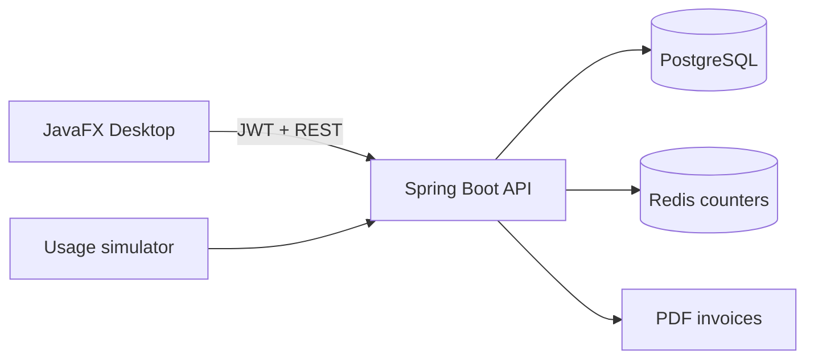

# Quota Flow

Quota Flow is a Java-based multi-tenant resource metering, quota enforcement and cost-allocation platform. It protects shared SaaS infrastructure by measuring each customer's usage in real time, warning at configurable thresholds, blocking requests beyond hard limits and producing billing-ready reports.

## Real-world example

ABC Logistics receives 10,000 parcel-tracking API requests per month. Quota Flow records each request, warns the tenant at 80%, marks usage critical at 90%, and atomically blocks usage beyond 100%. The tenant sees only its own usage and invoice; the Platform Admin manages all tenants, plans and compliance data.

## Highlights

- One JavaFX application with role-based Platform Admin and Tenant Admin dashboards
- JWT authentication, BCrypt passwords and tenant isolation
- Atomic Redis Lua quota enforcement under concurrent load
- PostgreSQL persistence for users, tenants, plans, usage events and audit logs
- Normal, warning, critical and blocked quota states
- Monthly counter isolation and automatic period rollover
- Billing and cost-allocation reports
- Downloadable PDF invoices
- Tamper-evident SHA-256 chained audit trail
- Usage charts, alerts, sidebar navigation and live simulator
- Admin forms for adding subscription plans and tenants
- Clean JSON error responses
- Docker, one-click startup and Windows packaging scripts

## Architecture



PostgreSQL is the permanent system of record. Redis holds high-speed monthly counters. Every accepted and denied usage decision is also persisted in PostgreSQL for reconciliation.

## Technology

- Java 17
- Spring Boot 4.1.1, Spring MVC, Spring Security, Spring Data JPA
- PostgreSQL 17 and Redis 7.4
- JavaFX 21
- Maven, Docker Compose, JWT and Hibernate

## Project structure

```text
quota-platform/
├── backend/                 Spring Boot REST API
├── desktop-client/          JavaFX application
├── docker-compose.yml       PostgreSQL and Redis
├── docker-compose.full.yml  Containerized full backend stack
├── start-quota-flow.ps1     One-click local startup
├── simulate-usage.ps1       Realistic usage generator
├── package-windows.ps1      Windows JavaFX packager
└── DEMO_CHECKLIST.md        Hackathon presentation flow
```

## Quick start on Windows

Prerequisites: JDK 17+, Maven, Docker Desktop and PowerShell.

```powershell
Set-ExecutionPolicy -Scope Process Bypass
.\start-quota-flow.ps1
```

Manual startup:

```powershell
docker compose up -d
cd backend
.\mvnw.cmd spring-boot:run
```

In another terminal:

```powershell
cd desktop-client
mvn javafx:run
```

## Demo users

| Role | Email | Local demo password |
|---|---|---|
| Platform Admin | `admin@quotaplatform.com` | `Admin@12345` |
| Tenant Admin | `admin@abclogistics.com` | `Tenant@12345` |

These credentials are demo data only. Do not use them in production.

## Generate live data

Keep Docker and the backend running:

```powershell
.\simulate-usage.ps1 -Events 25
```

You can also generate one event inside the Tenant Admin dashboard. Events are written to Redis and PostgreSQL.

## Tests

```powershell
cd backend
.\mvnw.cmd test
```

The suite verifies application startup, atomic concurrent quota enforcement and monthly counter isolation.

## Package JavaFX for Windows

`jpackage` is included with modern JDK installations:

```powershell
.\package-windows.ps1
```

Output:

```text
desktop-client\target\installer\QuotaFlow\QuotaFlow.exe
```

## Important API routes

| Method | Route | Purpose |
|---|---|---|
| POST | `/api/auth/login` | Authenticate and receive JWT |
| GET/POST | `/api/plans` | Read or create subscription plans |
| GET/POST | `/api/tenants` | Platform tenant management |
| POST | `/api/usage/{tenantId}/consume` | Atomically consume quota |
| GET | `/api/usage/{tenantId}/events` | Recent persisted usage events |
| GET | `/api/reports/tenants/{tenantId}/usage` | Usage summary |
| GET | `/api/reports/tenants/{tenantId}/billing` | Billing report |
| GET | `/api/reports/tenants/{tenantId}/invoice.pdf` | Download invoice |
| GET | `/api/audit/verify` | Verify audit chain |

## Deployment

1. Copy `.env.example` to `.env` and replace every secret.
2. Build locally with `docker compose -f docker-compose.full.yml up --build`.
3. Deploy the backend container to Render, Railway, Azure, AWS or another container host.
4. Provision managed PostgreSQL and Redis and set `DB_URL`, `DB_USERNAME`, `DB_PASSWORD`, `REDIS_HOST`, `REDIS_PORT`, `JWT_SECRET` and `PORT`.
5. Change `ApiClient.BASE_URL` to the deployed backend URL before packaging JavaFX.

Never commit `.env`, production credentials, JWTs or database volumes.

## GitHub publication

```powershell
git init
git add .
git commit -m "Build Quota Flow multi-tenant quota platform"
git branch -M main
git remote add origin https://github.com/YOUR_USERNAME/quota-flow.git
git push -u origin main
```

## Future production enhancements

- Refresh tokens and account-password management
- Flyway database migrations instead of `ddl-auto: update`
- Email/Slack quota notifications
- Persistent invoice lifecycle and payment integration
- Metrics, tracing and centralized logs
- TLS, secret manager and rate limiting

## Author

Tejashri Bambal
